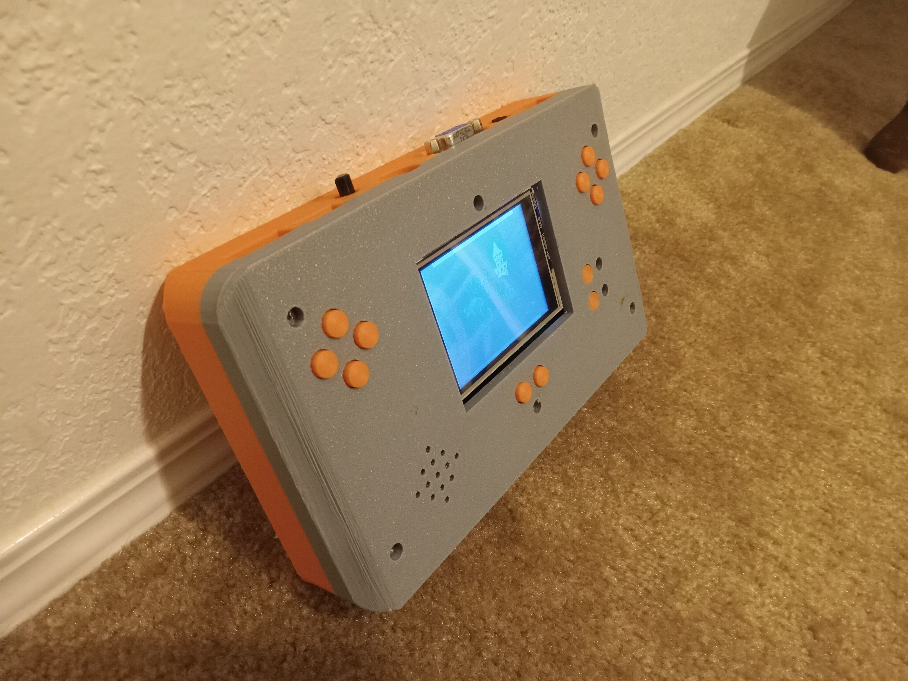
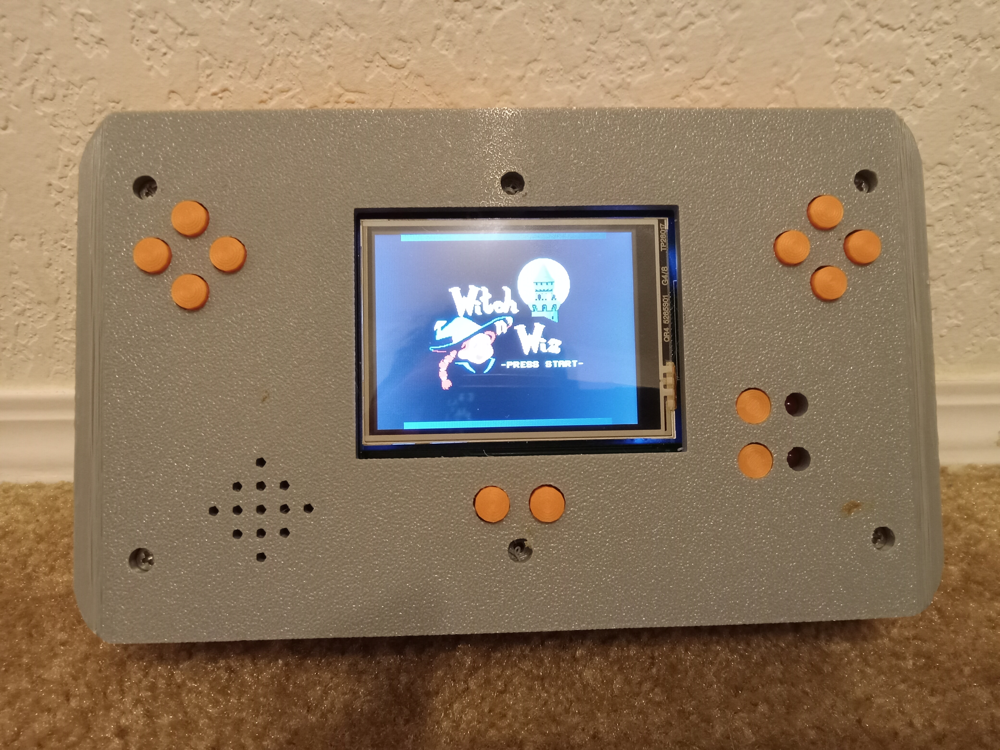
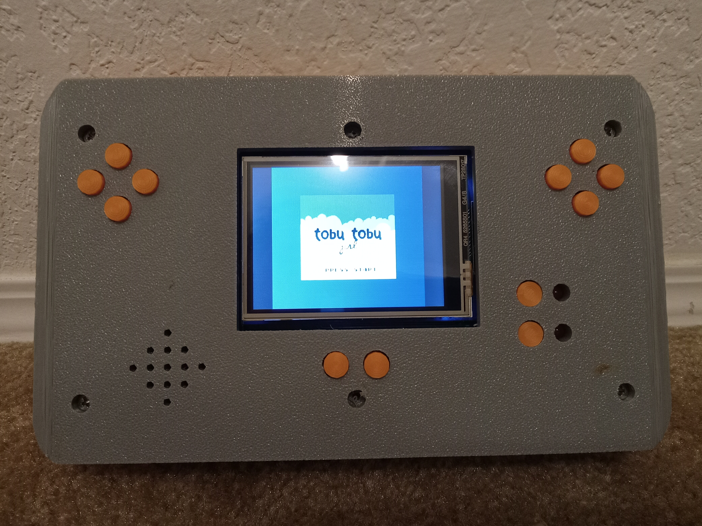
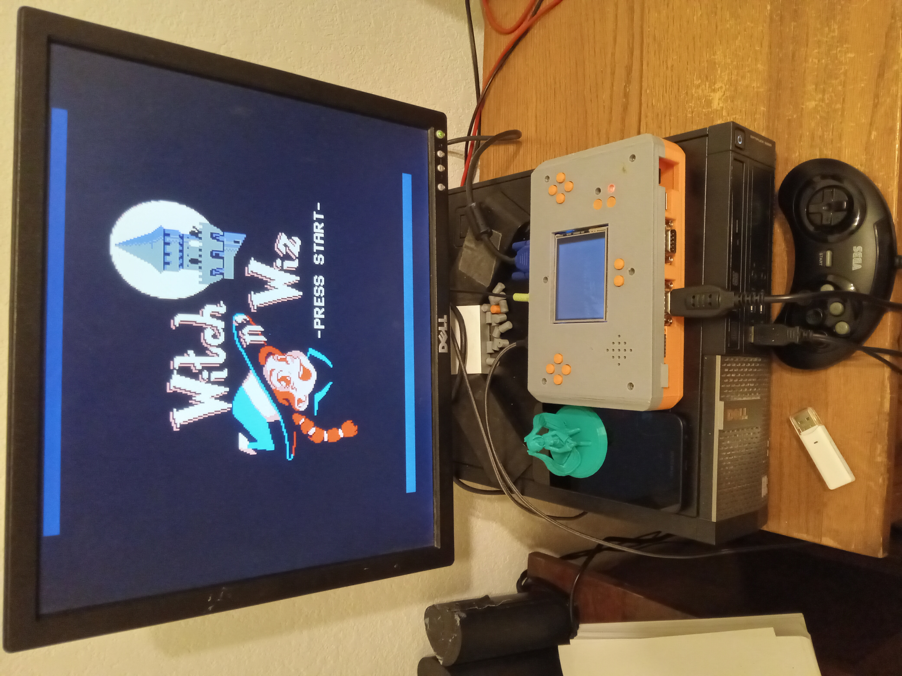
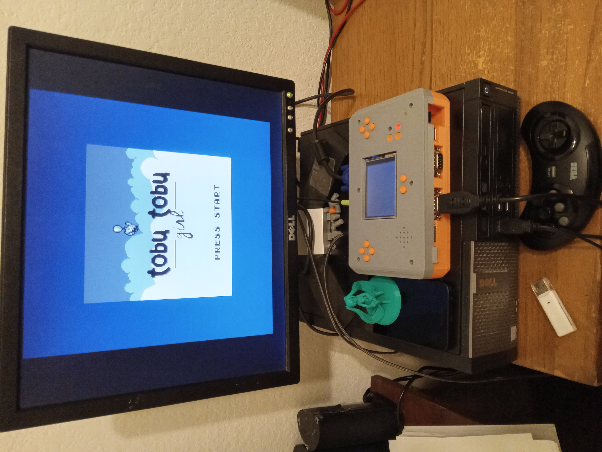
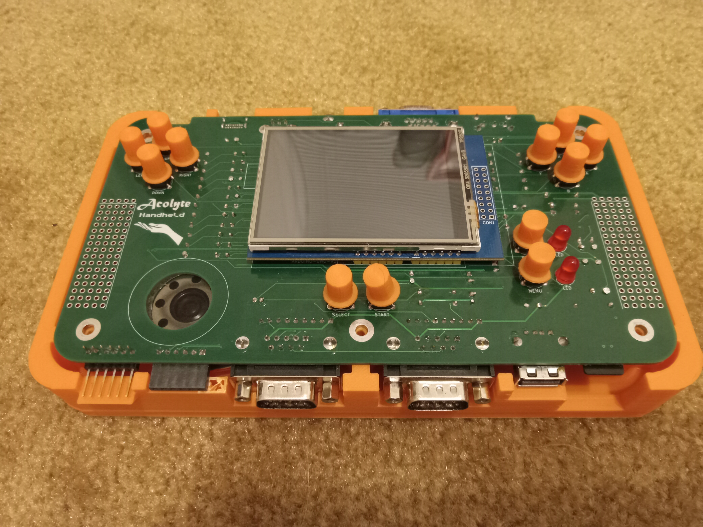
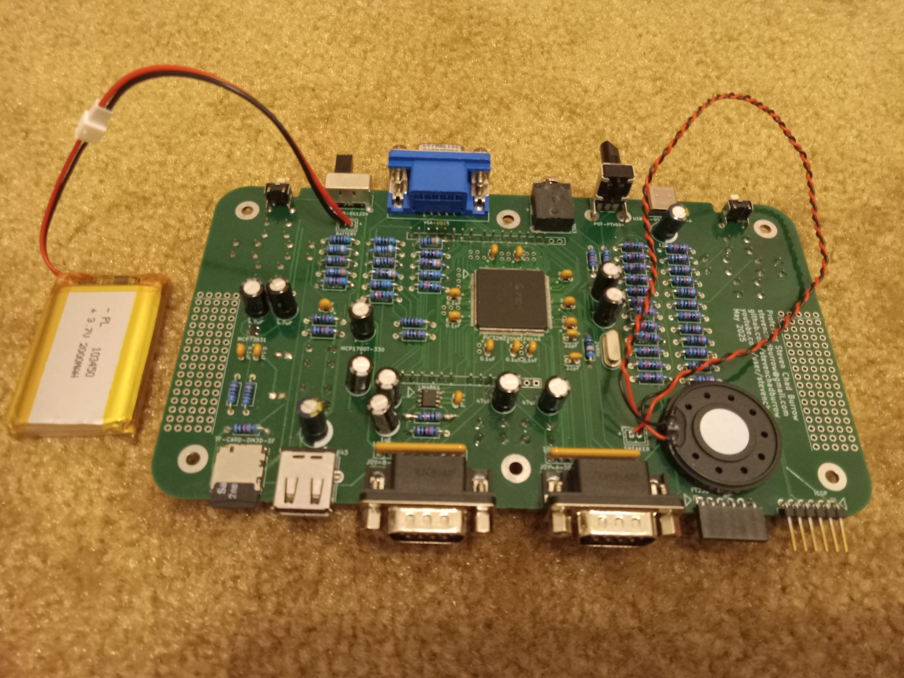

# Acolyte Handheld

The Acolyte Handheld is a portable PIC32MZ based game console.  It is programmed with my own homebrew NES emulator, as well as the <a href="https://github.com/deltabeard/Peanut-GB">Peanut-GB Emulator</a> and the <a href="https://github.com/ITotalJustice/TotalSMS">TotalSMS Emulator</a>.  Most of the code is derived from my previous project <a href="https://github.com/stevenchadburrow/AcolyteHandPICd32">here</a>. 

<b>Features</b>

<ul>
  <li>Runs on a battery and is charged by a USB-C cable.</li>
  <li>Switchable between VGA and LCD displays without needing to reboot.</li>
  <li>Supports four players simultaneously through the use of additional controllers.</li>
  <li>The built-in NES emulator has been tested with over 120+ games at this point, including but not limited to the list <a href="https://github.com/stevenchadburrow/AcolyteHandPICd32/tree/main/NES">here</a>.  As a benchmark, Super Mario Bros 3 currently runs full speed at 20 FPS.  My demo video of Super Mario Bros 3 can be found <a href="https://www.youtube.com/watch?v=WGrEMQLWrP4">here</a>.</li>
  <li>The imported GB/GBC emulator is very accurate and runs games at full speed.</li>
  <li>The imported SMS/GG/SG emulator is very accurate and runs games at full speed.</li>
  <li>Custom built 3D printed enclosure and buttons.</li>
</ul>

<b>Specifications</b>

Microchip PIC32MZ2048EFH144 running at 260 MHz (slightly overclocked) 
Internal memory of 512KB of RAM and 2MB of Flash ROM 
Soon to come: 4MB SQI external Flash ROM 

<b>Video</b>

VGA 1024x768 resolution at 60 Hz with 256 colors or 65K colors 
ILI9341 LCD 320x240 resolution with 65K colors 
Effective resolution of NES emulator at 256x240, 3x integer scaled on VGA 
Effective resolution of GB/GBC/GG emulator at 160x144, 3x integer scaled on VGA 
Effective resolution of SMS/SG emulator at 256x192, 3x integer scaled on VGA 

<b>Audio</b>

Dual 6-bit audio channels 
Headphone jack and internal speaker 

<b>HID</b>

2x Sega Genesis controller ports 
USB port for keyboard, mouse, or Xbox-360 type controller 
14 mappable buttons on device 

<b>File System</b>

Elm-Chan's <a href="https://elm-chan.org/fsw/ff/">FatFS Generic FAT Filesystem Module</a> for Micro TF Cards 
(use command 'sudo mkfs.vfat /dev/sdX' to format card) 

<b>UART</b>

FT232RL USB-to-UART adapter 
(use command 'sudo picocom /dev/ttyUSB0' for default 9600 baud connection) 

<b>NES Emulator</b>

My own homebrew NES Emulator, supporting NROM, UxROM, CxROM, AxROM, MMC1, and MMC3 mappers 
Programmed with speed over accuracy in mind, runs most games at full speed without alteration 
Supports settings adjustments, game save files, and save-states 

<b>GB/GBC Emulator</b>

Mahyar Koshkouei's <a href="https://github.com/deltabeard/Peanut-GB">Peanut-GB (with MiniGB-APU) Emulator</a> 
Copied and edited from the <a href="https://github.com/froggestspirit/Peanut-GB/">Version by "froggestspirit"</a> for GBC support 
Supports 1.5x scaling, DMG/GBC palettes, and game save files 

<b>SMS/GG/SG Emulator</b>

ITotalJustice's <a href="https://github.com/ITotalJustice/TotalSMS">TotalSMS Emulator</a> 
Supports SMS / GG / SB games on same emulator, with game save files 

<b>Links</b>

<a href="http://forum.6502.org/">http://forum.6502.org/</a> for the 6502 Forum, an incredible resource for everything 6502 related. 
<a href="https://www.nesdev.org/wiki/Nesdev_Wiki">https://www.nesdev.org/wiki/Nesdev_Wiki</a> for the very best NES programming guidance.  
<a href="https://www.aidanmocke.com/">https://www.aidanmocke.com/</a> for a bunch of PIC32MZ projects (without Harmony), including USB. 
<a href="http://elm-chan.org/">http://elm-chan.org/</a> for a bunch of projects, including MMC (aka TF Card) and FatFs. 
<a href="https://github.com/deltabeard/">https://github.com/deltabeard/</a> for a bunch of projects, including Peanut-GB and MiniGB-APU projects. 
<a href="https://github.com/froggestspirit/">https://github.com/froggestspirit/</a> for a bunch of projects, including the GBC version of Peanut-GB. 
<a href="https://github.com/ITotalJustice/">https://github.com/ITotalJustice/</a> for a bunch of projects, including TotalSMS and other emulators. 
<a href="https://github.com/bfirsh/jsnes/tree/master/roms/lj65">https://github.com/bfirsh/jsnes/tree/master/roms/lj65</a> for LJ65 download and license (ROM in source). 
<a href="https://hackaday.com/2025/06/19/game-boy-nes-why-not-both/">https://hackaday.com/2025/06/19/game-boy-nes-why-not-both/</a> for the Hack-A-Day article! 

<b>Pictures</b>

